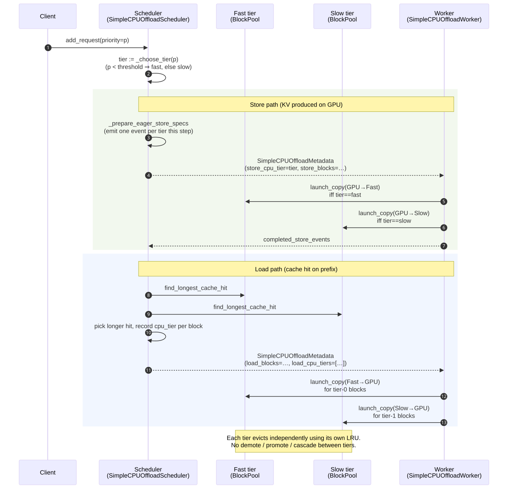
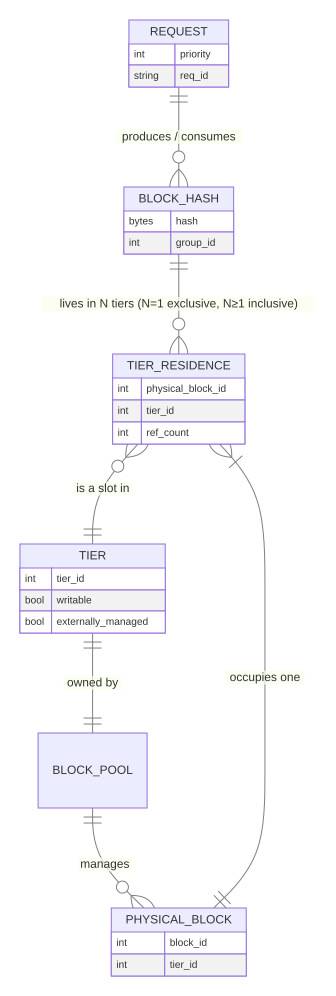

# Exclusive tiered caching — M1 component design

| | |
| --- | --- |
| **Status** | Draft |
| **Branch** | `dev` |
| **Owner** | @wangchen615 |
| **Created** | 2026-05-20 |
| **Last revised** | 2026-05-31 (rebased onto `OffloadingConnector`; added Host Memory Pool Manager + cross-deployment recovery) |
| **Implements** | `placement_mode = "partitioned"` for M1, plus the cross-deployment recovery primitive |
| **Companion** | [secondary-memory-m1-implementation.md](secondary-memory-m1-implementation.md) (file-by-file edit list) |
| **Parent** | [secondary-memory-system-overview.md](secondary-memory-system-overview.md) |

This document is the **component-level design** for M1. The implementation plan ([secondary-memory-m1-implementation.md](secondary-memory-m1-implementation.md)) gives the file-by-file edit list against `OffloadingConnector`; this document gives the *behavior* — how the new spec, the multi-medium manager, the admission policy, the Host Memory Pool Manager, and the cross-deployment recovery path interact.

## 1. M1 in one paragraph

M1 ships a new `OffloadingSpec` (`SecondaryMemoryOffloadingSpec`) that registers two CPU media — `FAST_CPU` and `SLOW_CPU` — through the existing `OffloadingConnector` factory. Both media are backed by **one shared host-memory pool** owned by an external **Host Memory Pool Manager** (HMPM). vLLM instances attach to the pool through the HMPM rather than creating their own private mmap region. New stores are routed to a medium by an **admission policy** keyed on `Request.priority`. There is no demote, no promote, no inter-medium copy. When two vLLM deployments share one HMPM-owned pool and one of them loses its accelerator, the survivor can prefetch the failed peer's blocks from the shared pool through the HMPM and resume in-flight requests without a cold re-prefill.

Everything below elaborates that paragraph.

## 2. Placement model — partitioned by priority

Each KV block lives in **exactly one** of the two CPU media for the lifetime of that block. Admission is decided once, at store time, from `Request.priority`. A block is never copied between media; each medium evicts independently using its own `CachePolicy` (LRU by default — already plug-in in `vllm/v1/kv_offload/cpu/policies/`).



Source: [`imgs/mmd/exclusive-tiered-placement.mmd`](imgs/mmd/exclusive-tiered-placement.mmd).

The "warmer" colors in the diagram represent the *intent*: the fast medium is meant for blocks the workload reuses most. M1 does not measure reuse — it uses request priority as a coarse proxy. A finer reuse-tracking signal (a heat counter per block) is reserved for the [`inclusive` placement mode](secondary-memory-resiliency.md#placement-mode-inclusive), which actually drives runtime decisions.

### What "exclusive" means and does not mean

- **Each *physical* block is in exactly one medium.** The block id returned from a medium's manager is unique within that medium. There is no shared physical block id space across media.
- **The same *content* may legitimately appear in both media's keymaps.** If two requests at different priorities both produce the same KV block (same prompt prefix, same model, same group), the high-priority instance lives in `FAST_CPU` and the low-priority instance lives in `SLOW_CPU`. Each is a different physical block. The load path is responsible for resolving which to serve from.
- **No demotion path.** When the fast medium fills, the next admission causes fast's own LRU victim to be **dropped**, not copied to slow. No CPU→CPU transfer is launched. Adding inter-medium copies turns this mode into `inclusive`, which is a separate placement mode with separate semantics — see the [resiliency RFC](secondary-memory-resiliency.md).
- **No promotion path.** A `SLOW_CPU` hit serves directly from slow. There is no implicit copy into fast on access.

### Why no demote / promote in this mode

The two media are admitting *different populations of requests* on purpose, not buffering the same requests at two speeds. Mixing in demote/promote would re-introduce the "fast is just a smaller cache of slow" semantics that the M1 mode deliberately avoids — that model is the `inclusive` placement mode and is covered separately.

## 3. End-to-end flow

The figure below shows one scheduler step plus the corresponding worker activity for both the **store** path (KV blocks just produced on the GPU need to land in CPU) and the **load** path (a new request hits the prefix cache).



Source: [`imgs/mmd/exclusive-tiered-flow.mmd`](imgs/mmd/exclusive-tiered-flow.mmd).

### Store path — admission and medium choice

1. The scheduler calls `self.manager.prepare_store(keys, req_context)` (`offloading/scheduler.py:665`). This is unchanged from upstream — **no scheduler-side fork**.
2. The manager that gets called is our new `MultiMediaOffloadingManager`, which holds two backing `CPUOffloadingManager` instances (one per medium).
3. The multi-medium manager reads `req_context.priority` and routes the entire `prepare_store` call to either `_fast.prepare_store(...)` or `_slow.prepare_store(...)` based on the admission policy. Whichever backing manager is chosen returns the `PrepareStoreOutput`; the multi-medium manager passes it back unchanged.
4. The worker dispatches by the `(src_type, dst_type)` of the resulting `LoadStoreSpec`. Because our spec yields four handlers (`GPU→FAST_CPU`, `FAST_CPU→GPU`, `GPU→SLOW_CPU`, `SLOW_CPU→GPU`) from `get_handlers()`, the existing `OffloadingConnectorWorker` already knows where to send the copy.

The "one prepare_store per request per step" cap is the existing scheduler's behavior; we inherit it.

### Load path — prefix-cache lookup

1. The scheduler calls `self.manager.lookup(key, req_context)` per offload key (`offloading/scheduler.py:252, 275`).
2. The multi-medium manager checks `_fast.lookup(...)` first, then `_slow.lookup(...)`. Returns the first `True`. Returns `None` (in-flight) if either reports in-flight; returns `False` only if both report `False`.
3. On a hit, the scheduler calls `prepare_load`, which is routed to whichever medium answered the lookup. The returned `LoadStoreSpec` is medium-typed (`CPULoadStoreSpec` for both, but different physical block ids), so the existing dispatch sends the right copy.
4. There is no implicit "promote on load" copy.

If both media have hits for *different* prefix ranges of the same request, the longer hit wins; ties go to fast. This is the "longest contiguous from one medium" rule from the previous draft, now implemented inside the multi-medium manager rather than in scheduler code.

### Independent eviction

Each medium's backing `CPUOffloadingManager` runs its own policy (default LRU). When medium *M* needs a free slot:

1. The medium's `CachePolicy.evict(num_blocks_to_evict, protected)` returns the LRU victim.
2. The block is removed from *M*'s keymap only.
3. **No copy is issued anywhere.** The block content is gone.

A request that was relying on that block will simply prefix-miss the next time it tries to use it. Whether that miss is acceptable is a workload-level question; M1 does not promise capacity additivity.

## 4. The `MultiMediaOffloadingManager` abstraction

The two media are managed through a single composite manager so the scheduler does not branch on "fast vs slow" anywhere. Asymmetry lives at the admission decision (the policy that picks a medium for `prepare_store`); everything below that point is symmetric and delegated to the per-medium `CPUOffloadingManager`.



Source: [`imgs/mmd/cputier-class.mmd`](imgs/mmd/cputier-class.mmd) — file kept for diff continuity but contents rewritten for the new architecture.

```python
# vllm/v1/kv_offload/cpu/multi_media_manager.py  (new)

class MultiMediaOffloadingManager(OffloadingManager):
    """
    Composite manager that routes prepare_store to one of two backing
    CPUOffloadingManager instances based on an AdmissionPolicy.
    Lookup/load checks both, fast-first.

    Symmetric in everything except admission. Adding a third medium
    (e.g. on-disk) is a constructor change, not a refactor.
    """
    def __init__(
        self,
        fast: OffloadingManager,
        slow: OffloadingManager,
        admission_policy: AdmissionPolicy,
    ): ...

    def prepare_store(self, keys, req_context):
        target = self.admission_policy.choose(req_context)  # FAST or SLOW
        return target.prepare_store(keys, req_context)

    def lookup(self, key, req_context):
        # fast first, then slow; merge in-flight states correctly
        ...
```

The `AdmissionPolicy` is the only place the priority signal is read:

```python
# vllm/v1/kv_offload/cpu/admission.py  (new)

class AdmissionPolicy(Protocol):
    def choose(self, req_context: ReqContext) -> OffloadingManager: ...

class PriorityAdmissionPolicy:
    """Default. Reads ReqContext.priority; returns _fast if priority < threshold."""
    def __init__(self, fast, slow, threshold: int = 1): ...
```

Future placement modes (`hybrid`, `replicate`) replace `MultiMediaOffloadingManager` rather than the spec or the connector. M1's spec exposes `placement_mode` in `extra_config`; M1 only accepts `"partitioned"`.

### Plumbing `Request.priority` to `ReqContext`

The existing `ReqContext` (`vllm/v1/kv_offload/base.py:47-49`) carries `kv_transfer_params` only. We extend it with one optional field:

```python
@dataclass
class ReqContext:
    kv_transfer_params: dict[str, Any] | None = None
    priority: int = 0  # new — populated from Request.priority
```

The scheduler-side `RequestStatus` in `offloading/scheduler.py:141` becomes:

```python
self.req_context = ReqContext(
    kv_transfer_params=self.req.kv_transfer_params,
    priority=self.req.priority,  # already on Request, plumbed end-to-end
)
```

That is the only edit to the upstream `OffloadingConnectorScheduler`. Everything else lives in our new spec, manager, and policy classes.

## 5. The Host Memory Pool Manager (HMPM)

This component is new in M1 and replaces the per-instance `SharedOffloadRegion` for the M1 emulator path.

### Why a separate component

`SharedOffloadRegion` (`vllm/v1/kv_offload/cpu/shared_offload_region.py`) is hard-bound to a single vLLM instance: its mmap path is keyed by `instance_id` (`:50`), the first worker `O_EXCL`-creates the file (`:62-67`), and the creator `unlink`s the file on shutdown (`:184-191`). Two vLLM deployments cannot share that file without colliding on the path or losing the region when the first instance shuts down.

Cross-deployment recovery — the M1 acceptance criterion that one deployment can read another's offloaded blocks after a hardware failure — requires a region whose lifecycle is **not** tied to any one vLLM process. The cleanest factoring puts that ownership outside vLLM and lets vLLM instances *attach* to a pre-existing pool.

### Component shape

The HMPM is a **process-level service** running on the host (M1: a Python service in the same package; future: could become a system daemon or library). It:

- Owns the mmap-backed shared region (path: `/dev/shm/hillock_secondary_pool.mmap`, configurable).
- Maintains a global allocation table — which (deployment_id, block_key) tuples occupy which physical slots, in which medium.
- Exposes a small RPC API (Unix domain socket; protobuf or msgpack — implementation choice) to vLLM instances.

### M1 API surface (minimum)

```python
class HostMemoryPoolManager:
    def attach(self, deployment_id: str) -> AttachHandle: ...
    def detach(self, handle: AttachHandle) -> None: ...

    def allocate(
        self,
        handle: AttachHandle,
        medium: Literal["FAST_CPU", "SLOW_CPU"],
        keys: list[OffloadKey],
    ) -> AllocateResponse:
        """Reserve slots for the given keys. Returns physical block ids
        and any keys that had to be evicted from this deployment to make room."""

    def free(
        self,
        handle: AttachHandle,
        medium: str,
        block_ids: list[int],
    ) -> None: ...

    def lookup_peer(
        self,
        handle: AttachHandle,
        keys: list[OffloadKey],
    ) -> list[PeerHit]:
        """For each key, return whether ANY deployment has it stored,
        which medium, which physical block id. Used by survivor on peer failure."""

    def claim_orphan(
        self,
        handle: AttachHandle,
        peer_deployment_id: str,
        keys: list[OffloadKey],
    ) -> ClaimResponse:
        """Transfer ownership of blocks left behind by a failed peer to
        the calling deployment. The HMPM verifies the peer is unresponsive
        (heartbeat timeout) before granting."""
```

`AllocateResponse` carries the assigned `(medium, block_id)` per key; `claim_orphan` is the primitive cross-deployment recovery uses.

### Heartbeat and orphan detection

Each attached deployment sends a heartbeat (default: 1 Hz). The HMPM maintains per-deployment liveness state. A deployment that misses N heartbeats (default: 3) is marked **orphaned**; its blocks become eligible for `claim_orphan`. Heartbeat timing is configurable; the values above are starting points, not load-bearing constants.

### What HMPM is NOT

- **Not a KV cache manager.** It does not understand prefix caches, request semantics, or eviction policy in the LLM-serving sense. It owns slots and keys. Eviction *policy* lives in `CPUOffloadingManager.cache_policy` per attached deployment; the HMPM only enforces that a deployment cannot exceed its own quota.
- **Not a network service** in M1. Single-host scope only. Cross-host pools are post-M1.
- **Not a replacement for `SharedOffloadRegion`** in single-deployment use. Single-instance offload (today's `OffloadingConnector` users) keeps using `SharedOffloadRegion`. The HMPM is opt-in via spec config.

### Sequence: cross-deployment recovery



Source: [`imgs/mmd/resilience-cross-deployment.mmd`](imgs/mmd/resilience-cross-deployment.mmd).

1. Both deployments A and B are attached to the HMPM. A's blocks live in `FAST_CPU` (high-priority work) and `SLOW_CPU`. B is serving its own workload.
2. A's accelerator dies. A's heartbeats stop. After the timeout, the HMPM marks A as orphaned.
3. An external orchestrator (or a poll loop on B; mechanism out of scope for M1) notifies B that A's request set should be picked up. B computes the offload keys for A's in-flight requests.
4. B calls `lookup_peer(keys)` on the HMPM, gets back the medium + block id for each key A had stored.
5. B calls `claim_orphan(peer_deployment_id="A", keys=...)`. The HMPM transfers ownership; the blocks now count against B's quota.
6. B issues `CPU→GPU` loads through its existing `OffloadingConnectorWorker` for the claimed blocks. The load path is unchanged from a normal cache hit — the blocks are now in B's view of the pool.
7. B resumes serving A's in-flight requests with the prefetched KV. No re-prefill.

This sequence is the single highest-value test for M1 acceptance.

## 6. Block-key relationships

The figure below shows how a logical `OffloadKey` relates to physical blocks across media and to deployments. It is the data-model the HMPM and the multi-media manager share.



Source: [`imgs/mmd/block-tier-er.mmd`](imgs/mmd/block-tier-er.mmd).

In **partitioned**, the cardinality `OFFLOAD_KEY ||--o{ MEDIUM_RESIDENCE` is interpreted as "lives in *N* media, where *N = 1* per deployment." Across deployments, the same key can exist in multiple deployments' residences (each deployment's own copy). The same diagram is reused by the [resiliency RFC](secondary-memory-resiliency.md) with `N ≥ 1` for `inclusive` / `replicate` modes.

## 7. Store-event lifecycle

Each `OffloadingEvent` the manager emits goes through the lifecycle shown below.



Source: [`imgs/mmd/store-event-state.mmd`](imgs/mmd/store-event-state.mmd).

M1 implements the green path only: `Pending → InFlight → Completed → Reported`. The `Failed → Quarantined` branch is referenced from the [resiliency RFC](secondary-memory-resiliency.md); M1's worker does not detect failed copies — a `torch.Event` either completes or the process dies, and orphan blocks are reclaimed by the HMPM via the heartbeat path described above.

## 8. Configuration surface

This is the user-visible knobs the M1 spec exposes through `kv_connector_extra_config`.

| Key | Type | Effect |
| --- | --- | --- |
| `spec_name` | str | Set to `"SecondaryMemoryOffloadingSpec"` to opt in. Default `"CPUOffloadingSpec"` (upstream behavior). |
| `placement_mode` | str | `"partitioned"` (M1 default and only supported value). Future: `"inclusive"`, `"hybrid"`, `"replicate"`. |
| `fast_cpu_bytes` | int | Capacity of the `FAST_CPU` medium. |
| `slow_cpu_bytes` | int | Capacity of the `SLOW_CPU` medium. |
| `priority_threshold` | int | Default `1`. `request.priority < threshold` → `FAST_CPU`, else → `SLOW_CPU`. (vLLM convention: lower-int = higher-priority. So `priority=0` → fast, `priority>=1` → slow.) |
| `eviction_policy` | str | `"lru"` (default) or `"arc"`, per existing `_CACHE_POLICIES` registry. Applies independently to each medium. |
| `hmpm_enabled` | bool | Default `false`. When `true`, attach to the Host Memory Pool Manager instead of using a private `SharedOffloadRegion`. Required for cross-deployment recovery. |
| `hmpm_socket_path` | str | UDS path for the HMPM service. Default `/var/run/hillock-hmpm.sock`. |
| `hmpm_deployment_id` | str | Stable identifier for this vLLM instance in the HMPM's view. Defaults to vLLM `instance_id` if unset. |
| `cpu_bytes_to_use` (legacy) | int | Maps to `slow_cpu_bytes` with `fast_cpu_bytes=0`. Backwards-compatible. |

`placement_mode` is fixed to `"partitioned"` in M1. The keyword exists in the design so future RFCs can add the other modes without breaking the M1 config shape.

## 9. Worker-side mechanics

- **Existing `OffloadingConnectorWorker` is unchanged.** It dispatches by the `(src_type, dst_type)` pair returned from `OffloadingSpec.get_handlers()`. Our new spec yields four `(GPULoadStoreSpec, CPULoadStoreSpec, ...)` tuples — one for each (medium, direction) pair — and the worker handles dispatch automatically.
- **`CpuGpuOffloadingHandlers` is reused per medium.** We instantiate it twice — one with `num_cpu_blocks=fast_blocks`, once with `num_cpu_blocks=slow_blocks`. Each instance owns its own pinned-memory region. When `hmpm_enabled=true`, the pinned region is provided by the HMPM (a slice of the shared mmap) instead of being allocated locally; the handler interface is the same.
- **Streams**: the existing per-handler `load_stream` / `store_stream` pair is reused. CUDA serialization on a single stream pair across both handlers is fine; ordering is preserved.
- **Completion polling**: `OffloadingConnectorWorker.get_finished` polls all handlers' event lists; per-medium counters fall out of `OffloadingEvent.medium` for free.

## 10. What this RFC does not cover

- **Heat tracking and reuse-driven placement** — see [resiliency RFC, `inclusive` mode](secondary-memory-resiliency.md). M1 is priority-driven, not reuse-driven.
- **Cross-medium failover within a single deployment** — see [resiliency RFC](secondary-memory-resiliency.md). When `FAST_CPU` fails *inside one deployment* (e.g. the secondary memory hardware itself goes unresponsive), M1's behavior is "those requests re-prefill"; the resiliency RFC formalizes detection / quarantine / re-route. Cross-*deployment* recovery (peer death) is in M1.
- **Non-priority admission signals** (model id, request size, prompt length) — orthogonal; can be added by replacing `PriorityAdmissionPolicy` with a custom policy. The `AdmissionPolicy` Protocol is the seam.
- **Real secondary-memory backing** — the M1 emulator uses pinned host DRAM for the whole pool. Switching to a real backing is an HMPM-side change (the HMPM allocates from the real device); vLLM-side code is unchanged.
- **Multi-host pools** — HMPM is single-host only in M1.
- **HMPM API stability and security** — M1 ships an internal API. A stable public API (with auth, multi-tenant quotas, etc.) is post-M1.
