# Secondary memory system: resiliency across the memory hierarchy — design proposal

| | |
| --- | --- |
| **Status** | Proposal (no implementation yet) |
| **Owner** | @wangchen615 |
| **Created** | 2026-05-12 |
| **Companion** | [hillock-vmem-two-tier-offload.md](hillock-vmem-two-tier-offload.md) (M1 functional emulation — prerequisite) |
| **Parent** | [secondary-memory-system-overview.md](secondary-memory-system-overview.md) |
| **Siblings** | [exclusive-tiered-caching.md](exclusive-tiered-caching.md), [inclusive-hierarchical-caching.md](inclusive-hierarchical-caching.md) |

## Context

This RFC targets a **three-level memory hierarchy** for LLM KV cache:

```text
  GPU HBM  ↔  secondary fast memory system  ↔  slow DRAM on host
```

A companion RFC ([hillock-vmem-two-tier-offload.md](hillock-vmem-two-tier-offload.md)) covers **M1**: a functional emulation of that hierarchy using two CPU memory pools as stand-ins for the secondary fast memory system and the slow DRAM on host. M1 proves the Simple KV-offload connector can manage two address spaces with small, scoped changes.

> **Terminology**: This document uses neutral hardware-agnostic names — **secondary fast memory** for the novel middle tier and **accelerator** for any device that owns HBM. See [secondary-memory-system-overview.md §Terminology](secondary-memory-system-overview.md#terminology).

**This RFC covers the next question**: once the hierarchy is real, how do we exploit its natural redundancy to keep serving through memory-tier failures?

This is a **proposal, not a plan**. No implementation is scheduled. It exists on the M1 PR so reviewers can evaluate the long-term shape alongside the M1 code — the M1 abstractions must not foreclose this design.

## Motivation

This proposal is driven by **two distinct use cases** that both want to put the same data in more than one tier:

1. **Resiliency: surviving a memory-tier failure mid-serve** (covered by `hybrid` and `replicate`).
2. **Model sharing for agentic workflows with rapid model switches** (covered by a read-only / externally-managed variant of `replicate`).

Both use cases share the same core mechanism — blocks live in multiple tiers — so they belong in one design proposal even though their failure modes and lifecycles differ.

### Use case 1: resilient serving across memory-tier failures

A real three-level hierarchy is **naturally redundant**: when the secondary fast memory system and the slow DRAM on host both participate in KV offload, some blocks end up on both. A resilient design exploits that redundancy so a memory-tier hiccup doesn't take out live requests.

The diagrams below illustrate the three resiliency scenarios this RFC has to cover.

#### Scenario A — cross-deployment recovery from a failed accelerator

When one model deployment loses its accelerator (and with it, its HBM), another surviving deployment can fetch the failed deployment's high-priority / popular KV blocks from the **shared secondary fast memory pool** and resume in-flight requests without a cold re-prefill.


Source: [`imgs/mmd/resilience-cross-deployment.mmd`](imgs/mmd/resilience-cross-deployment.mmd).

#### Scenario B — recompute on tier failure (exclusive tiered)

Under [exclusive tiered caching](exclusive-tiered-caching.md), a high-priority request's KV blocks live **only** in the secondary fast memory pool. If that pool fails, those requests **re-prefill** on the accelerator. Slow-pool requests are unaffected.



Source: [`imgs/mmd/resilience-recompute-tiered.mmd`](imgs/mmd/resilience-recompute-tiered.mmd).

#### Scenario C — prefetch from slow on tier failure (inclusive hierarchical)

Under [inclusive hierarchical caching](inclusive-hierarchical-caching.md), the slow tier is a **superset** of the fast tier. Every block that was in fast also exists in slow. When the fast tier fails, recovery is a **prefetch from slow into HBM** — no re-prefill needed.



Source: [`imgs/mmd/resilience-prefetch-hierarchical.mmd`](imgs/mmd/resilience-prefetch-hierarchical.mmd).

Concretely, a production deployment may face:

- **Transient stalls** — a CXL link flaps, a remote NUMA node wedges, an ioctl hangs, an out-of-band firmware event takes a tier unresponsive for seconds.
- **Partial failures** — a pool is healthy but slow (thermal throttle, neighbor noise, flaky DMA path).
- **Planned degradation** — a tier is rebooted or reconfigured while the serving process stays up.

In all three cases the vLLM process is alive and other requests are still flowing. Dropping in-flight requests that happen to hit the sick tier — and forcing a cold re-prefill from scratch — is a poor outcome when another copy of the KV data is already sitting in the healthy tier. The goal: **transparent fall-over to the surviving tier, with at most a latency bump, no request failure, no re-prefill.**

### Use case 2: model sharing for agentic workflows

In a heavy-overcommit agentic deployment, many small models are loaded and unloaded across many accelerators on rapid time-scales — request-driven model switches measured in seconds, not minutes. Re-fetching each model from object storage on every switch is unacceptably slow.

The secondary-memory hierarchy can address this by treating the secondary fast memory tier as a **shared, canonical home for model weights**:

- The model is loaded once into the secondary fast memory pool by an external manager (the platform, not vLLM).
- Each accelerator that wants to serve the model **reads** it in from the shared tier on demand.
- The model **stays canonical in the secondary fast memory pool** even after an accelerator finishes — the next switch back is a fast read, not a re-load from object storage.
- Multiple accelerators can read the same model concurrently.

This is `replicate` semantically (the same data lives in the shared tier *and* in each executor's working set), with two extensions that distinguish it from the resiliency case:

- **Read-only**: the connector only reads from the shared tier — only the external manager writes. Writability is per-tier and per-mode.
- **Externally managed lifecycle**: the connector does not control allocation or eviction in the shared tier; the platform does. Blocks may appear and disappear independently of connector actions.

This use case does **not** require the failure-detection / failover machinery from use case 1 — model weights either load successfully or the request fails up-front. But it shares the placement-mode plumbing, which is why it lives in this RFC.

### Why this belongs in the connector, not the scheduler

For both use cases, the relevant property — tier health (use case 1) or tier writability/ownership (use case 2) — is a property of the offload substrate, not of request scheduling. Keeping mode handling, detection, and failover inside the connector (and specifically inside the existing `CpuTier` + `DmaCopyBackend` abstractions) means the scheduler stays unaware of tier topology — it just sees "KV cache hit" or "miss" as today. That keeps the blast radius small and makes the feature opt-in via a config flag.

## Design

### Placement modes (the core design space)

Resiliency is fundamentally a **placement** question: *do blocks live in one tier, the other, or both?* M1's `partitioned` mode is the non-resilient endpoint. Two more modes fill out the spectrum:

| Mode | Semantics | Effective capacity | Resiliency | In M1? |
| --- | --- | --- | --- | --- |
| **partitioned** | Each request is admitted to one tier based on a per-request signal (priority). The two tiers cache different sets of blocks. No inter-tier movement. | `fast + slow` (but each tier holds different blocks) | **None** — losing either tier loses whatever was admitted there | **Yes** (the only M1 mode) |
| **hybrid** | New stores go to fast; a bounded async mirror also writes to slow. Under capacity pressure the mirror is dropped (degrades to `partitioned`-like single-tier residence). | Between `min(fast, slow)` and `fast + slow` depending on pressure | Partial — recently-stored hot blocks are replicated, older ones may not be | No |
| **replicate** | Every store goes to both tiers. Loads prefer fast; slow is used on fast-miss or fast-failure. | `min(fast, slow)` | **Full** — either tier alone is sufficient to continue serving | No |

> **Cascade is split off into its own RFC, not one of these modes.** A two-CPU-tier inclusive cascade (write-fast, demote-on-eviction, slow as superset) is the subject of [inclusive-hierarchical-caching.md](inclusive-hierarchical-caching.md) — it is design-only future work and does not compose cleanly with `replicate` / `hybrid` (mixing demotion with replication produces ambiguous "where does this block live?" questions). The single-CPU-pool cascade that `OffloadingConnector` and `SimpleCPUOffloadConnector` already implement remains the right choice for deployments that want cascade today.

The mode is selected at connector init via a new `kv_connector_extra_config.placement_mode` field (default `"partitioned"`, preserving M1 behavior). Users pick where on the spectrum they sit based on workload:

- Class-of-service serving (priority-routed traffic, capacity-oriented) → `partitioned`
- Production serving with SLO guarantees on memory-tier failures → `replicate`
- Mixed production with some SLO headroom → `hybrid`
- Agentic / multi-model workloads with rapid model switches → `replicate` with the read-only / externally-managed variant (see "Model-sharing variant" below)

### Model-sharing variant of `replicate`

The agentic / model-sharing use case (motivation §2) reuses `replicate` semantically — same data lives in two tiers — but with two extensions to the per-tier contract:

| Property | Resiliency `replicate` | Model-sharing `replicate` |
| --- | --- | --- |
| Connector writes to slow tier? | Yes (every store mirrored) | **No** — read-only from connector's perspective |
| Allocation in slow tier | Connector-driven | **Externally driven** (platform manager) |
| Eviction in slow tier | Connector-driven (LRU) | **Externally driven** — blocks may disappear without connector action |
| Failure handling | Failover to other tier on hot failure | None — model load either succeeds or the request fails |

The connector exposes two new per-tier flags to encode this:

- `tier.writable: bool` — if `False`, the connector never issues store ops against this tier. Only loads.
- `tier.externally_managed: bool` — if `True`, the connector treats the tier's contents as authoritative-but-volatile; cache lookups respect what's there but don't assume a block stays around between scheduler steps. This affects the load path's "still cached?" recheck logic.

These flags are orthogonal to `placement_mode`. A `replicate` deployment for resiliency uses `writable=true, externally_managed=false` for both tiers. A `replicate` deployment for model sharing uses `writable=true, externally_managed=false` for the executor-local fast tier and `writable=false, externally_managed=true` for the shared secondary-fast-memory-backed slow tier. (Future deployments may mix all four combinations.)

The implementation impact on the connector is small once `placement_mode` is in: skip stores for `writable=false` tiers, and add a freshness check on load for `externally_managed=true` tiers.

### Failure model: hot failure

This proposal targets **hot failure**: a tier becomes unresponsive during live serving, not at process restart. That means recovery has to happen in-band, while other requests are flowing.

Cold-restart recovery (reload KV from the survivor on process boot) is a strictly easier problem and a reasonable fast-follow. It reuses the same health-state + placement infrastructure; the detection and failover paths are where the complexity lives.

### Mechanism stack

1. **Detect (per-tier timeout + health state)**
   - Add an optional `timeout_ms` parameter to `DmaCopyBackend.launch_copy`.
   - Per-tier health state machine: `healthy → suspect → quarantined`.
   - `healthy → suspect`: first timeout or error. Subsequent ops still try this tier but with aggressive back-off.
   - `suspect → quarantined`: N consecutive failures within window W. No new ops issued until re-enabled.
   - `suspect → healthy`: M consecutive successes within window W.

2. **Fail over (inline on read path)**
   - **Failover model: synchronous, single-retry, bounded.** On a fast-tier read timeout, the worker issues *one* retry on the slow tier from the same `get_finished` call. No speculative parallel issue (would double bandwidth on the healthy tier under failure storms); no async fallback (would require deferring the request, complicating scheduler interaction). The retry's deadline is `tier_timeout_ms` — total worst-case load latency is `2 × tier_timeout_ms` per failover.
   - **Retry budget is per-step, not per-block.** If multiple blocks for the same load event each timeout on fast, all retry on slow within the same step. A step that exceeds `step_timeout_budget_ms` (config, default `5 × tier_timeout_ms`) gives up and signals re-prefill rather than continuing to retry — bounds tail latency under correlated failures.
   - **Eligibility**: retry only if the block is known to be in slow (i.e., `placement_mode` ∈ {`hybrid`, `replicate`} *and* the block's `replica_tiers` includes slow). Otherwise the request falls back to re-prefill — same outcome as today's single-pool failure under `partitioned`.
   - On a slow-tier write failure under `replicate`, drop the mirror for that block and degrade it to single-tier residence (log once). Store to fast still succeeds.

3. **Quarantine**
   - Once quarantined, a tier is skipped by all new ops. Existing pinned blocks in that tier stay pinned (they might become reachable again), but the allocator no longer considers it.
   - First cut: manual re-enable via an admin RPC or config reload. Auto-heal is a follow-follow-up — it requires probing the tier safely without blocking live serving.

4. **Re-replication (on recovery)**
   - When a tier returns from quarantine, start a **rate-limited background re-replication** from the survivor to restore redundancy.
   - Bounded concurrency to stay off the critical path of live requests. Priority: recently-touched blocks first (most likely to be hit soon).

### Configuration surface

New fields in `kv_connector_extra_config`:

| Field | Type | Default | Effect |
| --- | --- | --- | --- |
| `placement_mode` | `"partitioned" \| "hybrid" \| "replicate"` | `"partitioned"` | Picks the placement policy. |
| `tier_timeout_ms` | int | `0` (disabled) | Per-op timeout on `DmaCopyBackend.launch_copy`. `0` = no timeout (M1 behavior). |
| `step_timeout_budget_ms` | int | `5 * tier_timeout_ms` | Total time a single scheduler step will spend on tier ops including retries. Once exceeded, remaining timed-out blocks signal re-prefill rather than retrying. |
| `tier_failure_threshold` | int | `3` | Consecutive failures to move `suspect → quarantined`. |
| `tier_recovery_threshold` | int | `10` | Consecutive successes to move `suspect → healthy`. |
| `replication_rate_limit_mb_s` | int | `256` | Cap on background re-replication bandwidth. |
| `tiers[i].writable` | bool | `true` | Per-tier flag. `false` makes the connector skip stores against this tier (model-sharing variant). |
| `tiers[i].externally_managed` | bool | `false` | Per-tier flag. `true` tells the connector the tier's contents may change without its action; load path adds a freshness recheck. |

Backward compat: omitting all of these reproduces M1 behavior exactly.

### Metadata changes over M1

The M1 RFC already carries per-block source-tier hints (`load_cpu_tiers: list[int]` in the worker metadata). This proposal reuses them:

- **`load_cpu_tiers`** becomes the list of **valid source tiers** for a block in preference order. Worker picks the first; on timeout it advances to the next.
- **New per-block field: `replica_tiers: set[int]`** — the tiers the block is known to exist in (for `replicate` / `hybrid`). Used by the failover read path to decide retry eligibility.

**`replica_tiers` is advisory, not authoritative.** The scheduler updates it on store-completion (insert) and quarantine (remove the quarantined tier), but it is *not* a global lock — the worker may briefly see a block listed in `replica_tiers` that has just been evicted from one of those tiers, and vice versa. The invariant we maintain is one-way: **if `replica_tiers` does *not* list tier T, the block is definitely not in T.** The opposite ("listed → present") is best-effort. Code that consumes `replica_tiers` must handle "miss in the supposed tier" as a normal outcome:

- **Failover**: if retry on slow misses, signal re-prefill (same as if `replica_tiers` had said "slow not present" to begin with).
- **Re-replication**: if re-replication source-read misses, skip that block and move on.

This advisory contract avoids cross-step locking and matches how `BlockPool.cached_block_hash_to_block` already behaves under concurrent eviction.

**Externally-managed tier consistency.** For tiers with `externally_managed=true` (the model-sharing variant), the connector cannot trust `replica_tiers` even as advisory — the platform may swap *different* data in under the same address without notifying us. We need a stronger invariant.

- **Mechanism (proposed)**: each block stored to or read from an externally-managed tier carries a **platform-provided version token** in `cached_block_hash_to_block`'s value (alongside the block ID). The token is opaque to the connector — it could be a generation counter, an epoch, or a cryptographic hash, depending on what the platform exposes.
- **Read path**: lookup gives `(block_id, expected_version)`. Worker reads the block *and* the tier's current version for that ID. Mismatch → treat as miss, evict the entry from `cached_block_hash_to_block`, signal re-prefill.
- **Why not content hash on read?** Possible, but expensive (requires a full block hash on the hot path). Reserved as a fallback if the platform can't expose a version token.

The platform contract for the model-sharing variant must therefore include a `get_version(block_id) -> opaque_token` API, even if the implementation is just a per-block monotonic counter. Locked in here so the implementation work doesn't discover this gap mid-PR.

No change to the block-hash encoding: each *physical* block still lives in exactly the tiers listed by `replica_tiers`, but replicated modes treat that set as advisory and verify on read where consistency requires it.

## Implementation sketch

Not scoped here, but to show the work is contained:

1. **Add `placement_mode` plumbing** through `SimpleCPUOffloadConnector.__init__` to `SimpleCPUOffloadScheduler` and `SimpleCPUOffloadWorker`.
2. **Replace M1's `_choose_tier(request)` admission helper** with a mode-aware store dispatcher. `partitioned` keeps M1's "store to one tier"; `hybrid` adds an async mirror on store; `replicate` stores to both synchronously. The change is local to a single method on the manager — eviction, load lookup, and metadata stay the same.
3. **Add `TierHealth` state** to `CpuTier` — a small state machine with counters, drained on each `build_connector_meta`.
4. **Wire `timeout_ms` through `DmaCopyBackend.launch_copy`** and expose a failure callback to the worker, which feeds the `TierHealth` state machine.
5. **Add the failover read path** in `SimpleCPUOffloadWorker.get_finished`: on timeout, check `replica_tiers`, resubmit on a surviving tier.
6. **Add a bounded re-replication scheduler** — a new low-priority event type, rate-limited by `replication_rate_limit_mb_s`.
7. **Add per-tier `writable` and `externally_managed` flags** for the model-sharing variant. Skip stores against `writable=false` tiers. Add a freshness recheck on the load path for `externally_managed=true` tiers (see "Externally-managed tier consistency" below for the chosen mechanism).

## Risks and open questions

- **Timeout tuning is hard**: too tight and healthy-but-slow tiers get quarantined under load; too loose and failures aren't detected fast enough to matter. First cut should be conservative + configurable, with telemetry to tune in production. `step_timeout_budget_ms` defaulting to `5 × tier_timeout_ms` is a guess — needs validation against real workloads.
- **Silent corruption is not covered**: this proposal defends against unresponsiveness, not wrong data. Checksumming per block is a materially larger project and probably a separate RFC.
- **Split-brain during re-replication**: if a tier is quarantined, serves reads anyway, then returns and has stale data — we need to version blocks or treat every recovery as "wipe + re-replicate from survivor." Decision: **wipe + re-replicate from survivor** on recovery in M2; revisit if perf shows it's the bottleneck. Versioning is the model-sharing variant's job (see "Metadata changes" above), and that mechanism should be reused if hot-failure recovery ever needs versioning too.
- **Auto-heal vs manual re-enable**: automatic recovery detection risks flapping. **Decision: manual re-enable in the first cut**, exposed via an admin RPC. Auto-heal is a follow-follow-up — needs a probe-while-quarantined mechanism that doesn't block live serving.
- **Cold-restart recovery**: arguably should be done **first** since it's simpler and provides most of the value for planned maintenance. **Open question: split this proposal into "resiliency-cold" and "resiliency-hot" mini-RFCs?** Cold uses the same `placement_mode` config and `replica_tiers` metadata; only the detection / failover machinery differs. Splitting would let cold-restart land sooner with a smaller blast radius.
- **Coordinating evictions across executors sharing a tier**: when N accelerators read from the same shared model tier, can any of them indirectly cause an eviction of a block another is depending on? In the model-sharing variant the platform manages eviction, so the answer depends on what the platform does. The connector's version-token check on load handles this safely (mismatch → re-prefill), but the cost depends on how cheap `get_version` is. **Open**: needs a number from the platform team before commitment.
- **Scheduler interaction with retries**: the synchronous-retry model adds up to `2 × tier_timeout_ms` latency to a load on failover, which the scheduler doesn't know about. In a scheduling step, this can shift the latency profile of one step but does not change the scheduler's correctness — the step still completes. **Open**: whether to surface tier-failover events as a metric the scheduler can consume (for adaptive batching) or keep them invisible (simpler). M2 default: invisible; metric for telemetry only.

## Relationship to M1

M1 lands no resiliency code and no model-sharing code. What M1 **must not foreclose** — already honored in the M1 RFC's design:

- `CpuTier` is a **symmetric abstraction** — no "fast"-vs-"slow" asymmetry leaks into the code paths that `placement_mode` will later flip. The only asymmetry (admission decision) lives in `SimpleCPUOffloadScheduler._choose_tier(request)`, easy to swap per mode.
- Worker metadata already carries per-block source-tier hints (`load_cpu_tiers`). That field generalizes to "valid tiers in preference order" without a schema change.
- `DmaCopyBackend.launch_copy` has no `timeout_ms` yet. M1 leaves the signature alone; this proposal adds the parameter as an optional kwarg.
- `CpuTier` does **not** assume the connector owns the tier's lifecycle (write path conditional on a writability flag; eviction logic tolerant of externally-managed tiers). Required by the model-sharing variant of `replicate`.

If M1 review uncovers anything that would constrain this proposal, we update both RFCs together.
