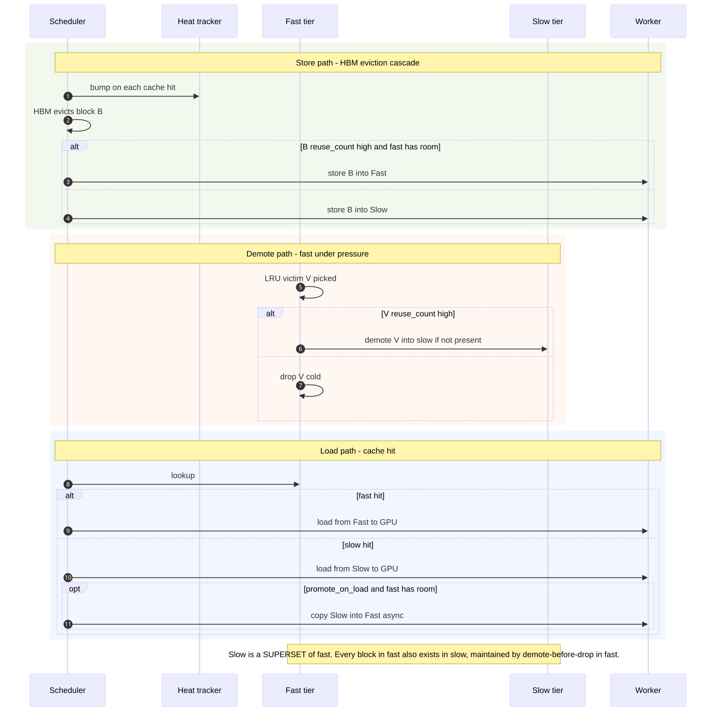

# Inclusive hierarchical caching — design (future work)

| | |
| --- | --- |
| **Status** | Draft / future work — design only, not scheduled for M1 |
| **Branch** | n/a (design doc) |
| **Owner** | @wangchen615 |
| **Created** | 2026-05-20 |
| **Implements** | `placement_mode = "inclusive"` (proposed token) |
| **Parent** | [secondary-memory-system-overview.md](secondary-memory-system-overview.md) |
| **Sibling** | [exclusive-tiered-caching.md](exclusive-tiered-caching.md) (the M1 mode), [secondary-memory-resiliency.md](secondary-memory-resiliency.md) |

This document specifies a **second placement model** for the secondary-memory hierarchy: an **inclusive cascade** between the two CPU tiers, with explicit promote and demote paths. It is **not** scheduled for M1 — the M1 RFC ([exclusive-tiered-caching.md](exclusive-tiered-caching.md)) commits to the partitioned/exclusive model only. This RFC exists so that M1's abstractions are sized correctly to admit this mode later without invasive refactors.

## How this differs from existing vLLM cascade connectors

vLLM's `OffloadingConnector` and the upstream `SimpleCPUOffloadConnector` already implement an inclusive cascade — but **between HBM and a single CPU pool**. This RFC's contribution is to extend cascade semantics to **two CPU tiers** (a near-accelerator secondary fast memory pool and a slow host DRAM pool), with the slow tier kept as a **superset** of the fast tier, and with **reuse-driven** promote/demote between them. The slow tier always evicts last; the fast tier holds only the hottest blocks.

This is the conventional "tiered cache with promotion" model from systems literature, applied to LLM KV cache across two CPU address spaces.

## 1. Placement model

The two CPU tiers form an **inclusive hierarchy**: every block resident in fast is also present in slow. Slow is a superset. Eviction from HBM cascades into the hierarchy; eviction from fast demotes (if not already in slow); eviction from slow drops the block.

Source: [`imgs/mmd/inclusive-hierarchical-placement.mmd`](imgs/mmd/inclusive-hierarchical-placement.mmd).

### Invariants

- `fast ⊆ slow`. Every block in the fast tier is also in the slow tier.
- A block leaves the system only when it is evicted from **slow**. Eviction from fast alone never destroys content.
- Reuse rate (a heat counter) is the placement signal — higher heat → fast, lower heat → slow only.

### Why these invariants

The superset invariant gives a simple resiliency story (covered in [resiliency RFC §prefetch](secondary-memory-resiliency.md)): if the fast tier fails, **every block can still be served from slow**. No re-prefill is needed. This is the resiliency mechanism that the partitioned mode does not have.

## 2. End-to-end flow

The figure below shows three orthogonal paths: the HBM-eviction store path (which decides whether to admit into fast or slow), the demote path (when fast is under pressure), and the load path (with optional promotion on slow hit).

Source: [`imgs/mmd/inclusive-hierarchical-flow.mmd`](imgs/mmd/inclusive-hierarchical-flow.mmd).

### Store path (HBM eviction)

1. The scheduler bumps the per-block heat counter on each cache hit. (Heat is a small integer, decayed periodically — concrete decay schedule deferred to implementation.)
2. When HBM evicts block *B*:
    - If `B`'s heat is high **and** the fast tier has room, store *B* into **fast** (and eventually into slow on next demote — see invariant `fast ⊆ slow`; in practice the fast write is paired with a slow write so the superset is maintained from the start).
    - Otherwise store *B* into **slow** only.

### Demote path (fast-tier pressure)

1. Fast picks an LRU victim *V*.
2. If *V* is hot (high heat), copy *V* into slow if not already there, then drop from fast.
3. If *V* is cold, drop from fast directly. Slow already holds the master copy.

The "drop from fast" step is what makes the fast tier behave as a *cache* of slow, not a partition.

### Load path (cache hit)

1. Look up in fast. If hit, copy fast → GPU. Done.
2. If fast missed, look up in slow. If hit, copy slow → GPU.
3. **Optional**: if `promote_on_load` is enabled and fast has room, kick off an async fast-tier write of the loaded block. The GPU does not wait on this.

The promote-on-load path is asynchronous and never on the critical path of the request; it is a **prediction** that the block will be hot.

## 3. Reuse of `CpuTier` from M1

Inclusive hierarchical mode reuses the [`CpuTier`](exclusive-tiered-caching.md#3-the-cputier-abstraction) abstraction from M1 verbatim. It additionally requires:

- **A heat counter per cached block hash**, maintained by the scheduler (a side `dict[block_hash, int]` keyed alongside `BlockPool.cached_block_hash_to_block`). Heat is updated on every cache hit and on every store. Decay is periodic.
- **A host↔host `DmaCopyBackend`** (or a thin `MemcpyKind.HostToHost` path) for the demote and promote copies. M1 deliberately does not need this; this mode does.
- **A demote event type** in `SimpleCPUOffloadMetadata` (`demote_event`, `demote_src_blocks`, `demote_dst_blocks`) and a matching completion path in the worker.

These are additive — none of them change the M1 type signatures.

## 4. Block-hash relationships

The same ER diagram as exclusive tiered applies. The cardinality interpretation flips:

`BLOCK_HASH ||--o{ TIER_RESIDENCE` — "lives in *N* tiers, where *N ≥ 1*." A block in fast is also in slow, so it has two `TIER_RESIDENCE` rows.

See [`imgs/mmd/block-tier-er.mmd`](imgs/mmd/block-tier-er.mmd) (rendered in the [exclusive tiered RFC](exclusive-tiered-caching.md#4-block-hash-relationships)).

## 5. Configuration surface (proposed)

| Key | Type | Effect |
| --- | --- | --- |
| `placement_mode` | str | Set to `"inclusive"` to enable this mode. Default `"partitioned"` (M1). |
| `fast_cpu_bytes` | int | Capacity of the emulated secondary fast memory tier. |
| `slow_cpu_bytes` | int | Capacity of the emulated slow host DRAM tier. |
| `heat_promotion_threshold` | int | Heat counter value above which a block is admitted to fast. |
| `promote_on_load` | bool | If `true`, async-write to fast on a slow-tier load hit. |
| `heat_decay_period_steps` | int | Scheduler steps between decay sweeps of the heat counter. |

`priority_threshold` from M1 has no role in inclusive mode.

## 6. Why this is deferred past M1

1. **It needs heat tracking.** A reuse counter (with decay) is a non-trivial new piece of state in the scheduler. M1 deliberately avoids adding it because exclusive tiered does not need it.
2. **It needs a host↔host copy backend.** M1 does not — exclusive tiered never copies between tiers. Adding the backend (and its event lifecycle, completion accounting, error handling) is a meaningful chunk of work.
3. **The placement decision is more entangled with eviction.** In exclusive mode, admission is decided once and never revisited. In inclusive mode, every fast-tier eviction is also a placement decision (demote vs drop). That entanglement is the main reason a separate RFC is warranted.
4. **The resiliency story is different.** Inclusive mode's recovery from a fast-tier failure is **prefetch from slow** ([resiliency RFC](secondary-memory-resiliency.md)), not recompute. The two failure paths share the same `TierHealth` machinery but trigger different recovery actions.

## 7. What this RFC does not commit to

- An implementation timeline. This document is design-only.
- A specific heat-counter encoding (saturating uint8 vs. exponential decay vs. count-min). The choice is a tunable; the **existence** of the counter is what the design depends on.
- Interaction with `hybrid` / `replicate` placement modes. Those live in the [resiliency RFC](secondary-memory-resiliency.md). Combining inclusive cascade with replication would be a fourth mode and is out of scope here.

## 8. Relationship to existing vLLM connectors

`OffloadingConnector` and `SimpleCPUOffloadConnector` already implement an inclusive cascade — but only between **HBM and one CPU pool**. The contribution of this RFC is to add a **second CPU tier** with its own cascade semantics, while preserving the existing HBM↔CPU cascade behavior.

A reasonable forward-compatibility path is:

1. Land M1 ([exclusive tiered](exclusive-tiered-caching.md)) with `placement_mode="partitioned"`.
2. Add the host↔host backend and heat tracker behind a feature flag.
3. Add `placement_mode="inclusive"` selecting the cascade scheduler logic described above.

No prior step needs to be undone for the next step.
