# Secondary memory system — system overview & emulator design

| | |
| --- | --- |
| **Status** | Draft |
| **Branch** | `dev` |
| **Owner** | @wangchen615 |
| **Created** | 2026-05-20 |
| **Related** | [Exclusive tiered caching (M1)](exclusive-tiered-caching.md), [Inclusive hierarchical caching (future)](inclusive-hierarchical-caching.md), [Resiliency](hillock-vmem-resiliency.md) |

This document describes the **production hardware target** for a three-level KV-cache memory hierarchy and the **vLLM emulator** that lets us iterate on placement, resiliency, and observability without that hardware in hand.

It is the entry point to a small family of sibling RFCs:

- This doc — system + emulator overview.
- [Exclusive tiered caching](exclusive-tiered-caching.md) — the M1 placement model (partitioned by request priority).
- [Inclusive hierarchical caching](inclusive-hierarchical-caching.md) — future-work placement model (HBM eviction cascade with promote/demote between two CPU pools).
- [Resiliency](hillock-vmem-resiliency.md) — failure semantics and recovery across the hierarchy.

## Terminology

The diagrams and text in this RFC family use two neutral names so the design stays portable across hardware platforms and avoids any single product name:

- **Secondary fast memory system** — the novel middle tier in the production hierarchy.
- **Accelerator** — any device that runs the model and owns HBM (GPU, NPU, or other AI accelerator).

## 1. The production target

The production deployment pictured below is what the emulator in this repo is meant to stand in for. The middle box — the **secondary fast memory system** — is the novel piece. It sits closer to the accelerators than host DRAM (typically across a PCIe / CXL switch on the same pod), is *larger* than the accelerators' HBM, and is *faster* to reach than host DRAM. It is the place where the system can keep the tail of hot KV blocks that no longer fit in HBM.



Source: [`imgs/mmd/system-overview.mmd`](imgs/mmd/system-overview.mmd) — edit this file and re-render to update the diagram.

### What changes vs. a single-CPU-pool offload

A conventional vLLM offload connector sees one CPU pool. Two things change in the production target:

1. There are now **two address spaces below HBM**, with very different latency / bandwidth profiles. The secondary fast memory tier is reachable from the accelerator without crossing the host-DRAM path; the slow tier is normal pinned host DRAM.
2. The **placement policy** between those two address spaces is a first-class design choice — not just "evict from fast, demote to slow." Three placement modes are anticipated in the RFC family: `partitioned` (M1, [exclusive tiered](exclusive-tiered-caching.md)), `hybrid` and `replicate` ([resiliency RFC](hillock-vmem-resiliency.md)), and a separate `inclusive hierarchical` mode ([future](inclusive-hierarchical-caching.md)). Each one decides differently which tier holds which block and whether a block can live in more than one tier.

The combination of two physical address spaces *and* a real placement-policy choice is what motivates a new design rather than a small extension to an existing connector.

## 2. The emulator

vLLM does not yet have access to the production hardware in CI or in dev clusters, so M1 emulates the three-level hierarchy with **two pinned-host CPU memory pools** managed inside the existing `SimpleCPUOffloadConnector`.



Source: [`imgs/mmd/emulator-overview.mmd`](imgs/mmd/emulator-overview.mmd).

### What the emulator proves and does not prove

The emulator deliberately uses pinned host DRAM for *both* pools, so there is **no real latency asymmetry** between the two tiers in M1. That is by design: M1 is a functional-correctness milestone, not a performance milestone. What it has to demonstrate is:

- vLLM can manage **two independent CPU address spaces** through the Simple KV-offload connector with small, scoped changes.
- A **placement-policy abstraction** sits cleanly above the two pools, so future modes (`hybrid`, `replicate`, inclusive cascade) can be added without re-plumbing the worker.
- The completion + metadata wiring (events, fence semantics, per-tier counters) survives going from one tier to two.

What it explicitly does **not** prove (and is not expected to) — capacity additivity, prefix-miss speedup, real resiliency, or model-sharing throughput. Those depend either on a real secondary-memory backing or on placement modes outside M1's scope. They are tracked in the sibling RFCs.

## 3. How the sibling RFCs fit together

```text
   secondary-memory-system-overview.md   ← this doc
        ├── exclusive-tiered-caching.md         ← M1 placement (partitioned)
        ├── inclusive-hierarchical-caching.md   ← future placement (cascade)
        └── hillock-vmem-resiliency.md          ← failure model & recovery
                  hillock-vmem-two-tier-offload.md  ← M1 implementation plan
```

- The **M1 implementation plan** ([`hillock-vmem-two-tier-offload.md`](hillock-vmem-two-tier-offload.md)) is the concrete, code-level plan for the partitioned mode. The exclusive-tiered RFC describes the same model at a component-design level (placement, sequence, state, ER, class). Read the component RFC for *what* the system does; read the M1 plan for *which files change*.
- The **inclusive hierarchical** RFC is design-only — no code is committed for it in M1. It exists so the abstractions in M1 (`CpuTier`, the metadata layout, the worker copy backends) do not silently exclude it.
- The **resiliency** RFC owns `hybrid` / `replicate` placement modes and the failure-detection / failover / re-replication mechanisms. It is the natural follow-on after M1.

## 4. Out of scope for this overview

- Concrete capacity sizing for the secondary fast memory tier — workload-dependent, will follow once a real backing is wired up.
- Real-hardware drivers / kernel changes — outside vLLM.
- Multi-pod or cross-pod sharing of the secondary fast memory tier — out of scope here; one cross-deployment scenario lives in the [resiliency RFC](hillock-vmem-resiliency.md).
- Observability / metrics — to be added per-tier after the functional milestone lands.
